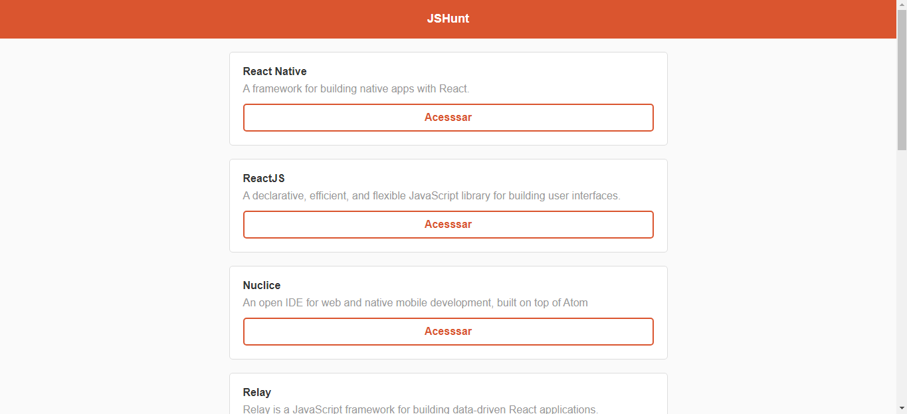
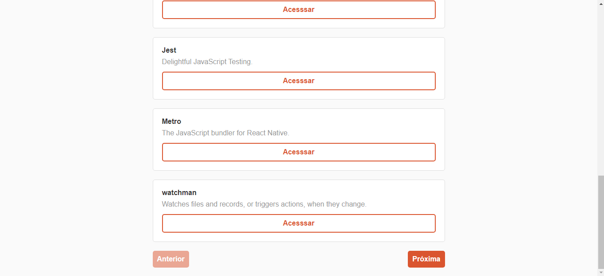
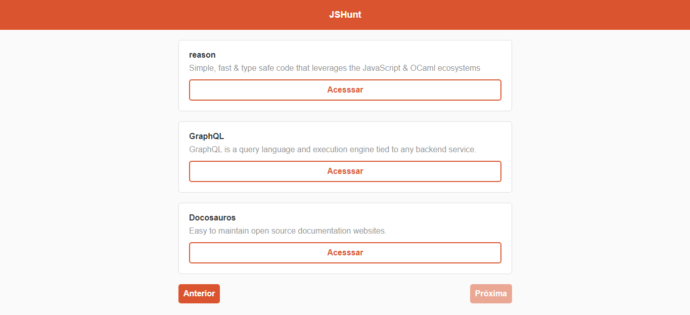
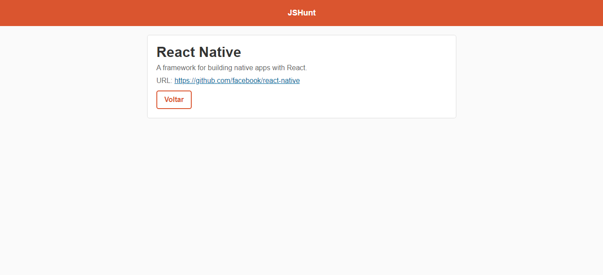

[](https://github.com/marioandre01)
[](#)
[](https://github.com/marioandre01/reactjs_starter_rocketseat/stargazers)
[](https://github.com/marioandre01/reactjs_starter_rocketseat/network/members)
[](https://github.com/marioandre01/reactjs_starter_rocketseat/graphs/contributors)
[](https://github.com/marioandre01/reactjs_starter_rocketseat/blob/master/LICENCE.md)


<h1 align="center">
    ReactJS Starter Rocketseat
</h1>

<p align="center"> 
  <a href="#-projeto">Projeto</a>&nbsp;&nbsp;&nbsp;|&nbsp;&nbsp;&nbsp;
  <a href="#-tecnologias">Tecnologias</a>&nbsp;&nbsp;&nbsp;|&nbsp;&nbsp;&nbsp;
  <a href="#-layout">Layout</a>&nbsp;&nbsp;&nbsp;|&nbsp;&nbsp;&nbsp;
  <a href="#bulb-funcionamento-da-aplicação">Funcionamento da aplicação</a>&nbsp;&nbsp;&nbsp;|&nbsp;&nbsp;&nbsp;
  <a href="#-executando-a-aplicação">Executando a aplicação</a>&nbsp;&nbsp;&nbsp;|&nbsp;&nbsp;&nbsp;
  <a href="#gear-contribuição">Contribuição</a>&nbsp;&nbsp;&nbsp;|&nbsp;&nbsp;&nbsp;
  <a href="#memo-licença">Licença</a>
</p>

## 💻 Projeto

Esse projeto foi desenvolvido por meio do curso ReactJS Starter da [Rocketseat](https://app.rocketseat.com.br/node/curso-react-js). O projeto tem como objetivo desenvolver uma aplicação frontend utilizando ReactJS para ter uma primeiro contato com essa tecnologia e entender seus conceitos e sua estrutura de funcionamento. A aplicação consiste em fazer uma requisição a uma API externa que retorna uma lista de dados com a informações de "Nome", "Descrição" e "URL" de uma tecnologia web. Com essas informações, as mesmas são renderizadas na tela, e usando CSS seu visual fica mais agradável. As informaçõe são limitadas em 10 por página, assim havendo mais de 10, deve-se acessar o botão "Próximo" para ver as outras informações. Em cada item da tecnologia listada há um botão "Acessar" que leva para uma página de detalhes da tecnologia. Nesta página é mostrado as informações de "Nome", "Descrição" e "URL" do github dessa tecnologia. Há também um botão voltar para retornar a página inicial da aplicação.   

## 📋 Tecnologias

O projeto foi desenvolvido com as seguintes tecnologias:

- Javascript
- [ReactJS](https://reactjs.org)
- React Router Dom 
- Axios
- HTML
- CSS

## 🎨 Layout

<p align="center">
  
  
  
  
</p>


<!-- ## :bulb: Funcionamento da aplicação !-->


## 💻 Executando a aplicação

### Requisitos necessários

Para executar o projeto é necessário ter instalado em seu sistema:
- NodeJS
- Gerenciador de pacotes Npm ou Yarn 

### :octocat: Clonando o Repositório

```bash
$ git clone https://github.com/marioandre01/reactjs_starter_rocketseat.git

# entre na pasta do projeto
$ cd reactjs_starter_rocketseat
```
### 💻 Executando a aplicação

Entre na pasta huntweb

```bash

$ cd huntweb

```
Instale as dependências

```bash

$ yarn

# ou pelo npm
$ npm install

```

Execute a aplicação

```bash

$ yarn start

# ou pelo npm
$ npm start

```

## :gear: Contribuição

Para contribuir com esse projeto faça os seguintes passos:

- Faça um fork desse repositório;
- Crie uma branch com a sua feature: `git checkout -b minha-feature`;
- Faça commit das suas alterações: `git commit -m 'feat: Minha nova feature'`;
- Faça push para a sua branch: `git push origin minha-feature`.

## :memo: Licença

Esse projeto está sob a licença MIT. Veja o arquivo [LICENSE](./LICENSE.md) para mais detalhes.


